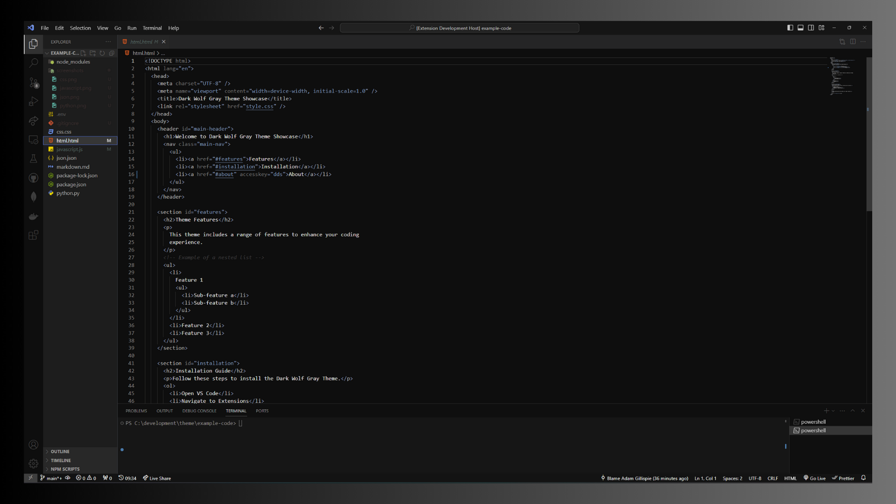
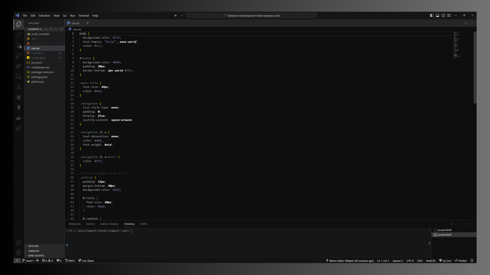
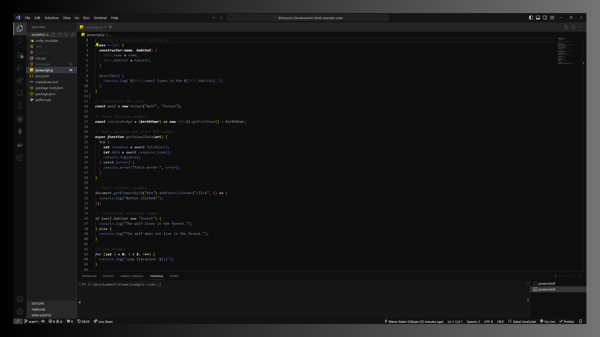
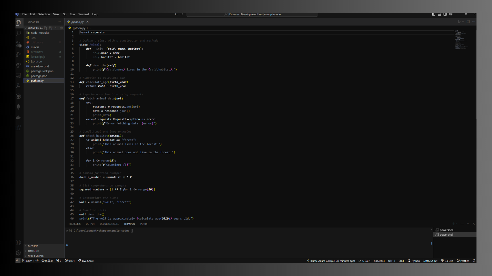
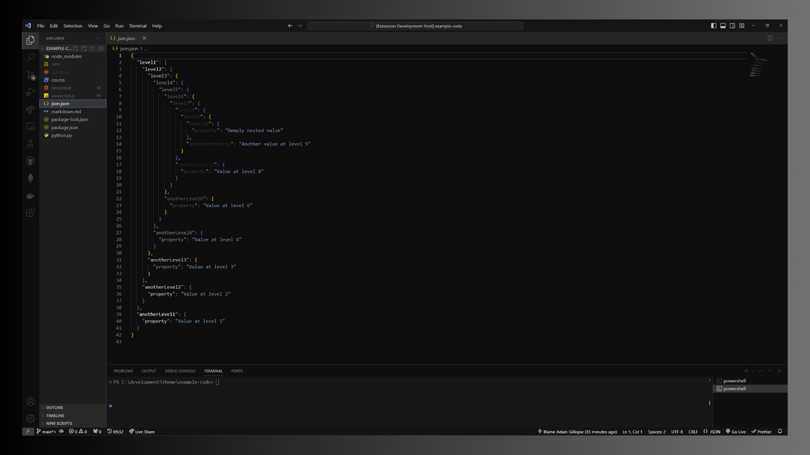

# Dark Wolf Gray - VS Code Theme

Embrace the essence of the night with **Dark Wolf Gray**, a Visual Studio Code theme that captures the mystique and elegance of a moonlit forest. Designed for developers who appreciate the subtle strength and majesty of the wolf in the quiet of the night.

## 🌑 Features

- **Muted Gray Tones:** Experience a spectrum of gray shades, reminiscent of a wolf's fur under the moonlight, from soft silvers to deep charcoals.
- **Nocturnal Aesthetics:** Elements inspired by the mysterious night, including gentle contrasts and sleek highlights that reflect the moon's glow.
- **Gentle on the Eyes:** Colors chosen to minimize eye strain, ideal for long nights of coding.
- **Syntax Highlighting:** Clear and distinct color usage for syntax highlighting, enhancing code readability and ease of navigation.
- **Compatibility:** Perfectly compatible with a wide array of programming languages and file types in VS Code.

## 🌖 Screenshots

### HTML

### CSS

### JavaScript

 <!-- Reference to JavaScript Screenshot -->

### Python

### JSON

## 🛠 Installation

1. Open **Extensions** sidebar panel in VS Code. `View → Extensions`
2. Search for `Dark Wolf Gray`
3. Click **Install**
4. Click **Reload** to refresh your editor
5. Code/File → Preferences → Color Theme → **Dark Wolf Gray**

## 📝 Feedback

Your feedback and suggestions are greatly valued! If you have any ideas or face any issues, please don't hesitate to open an issue in the [GitHub repository]("https://github.com/AKCodeWorks/dark-wolf-gray).

## 📘 License

This theme is open source and available under the MIT License

---

Immerse yourself in the tranquil yet powerful ambience of the night with **Dark Wolf Gray**!
